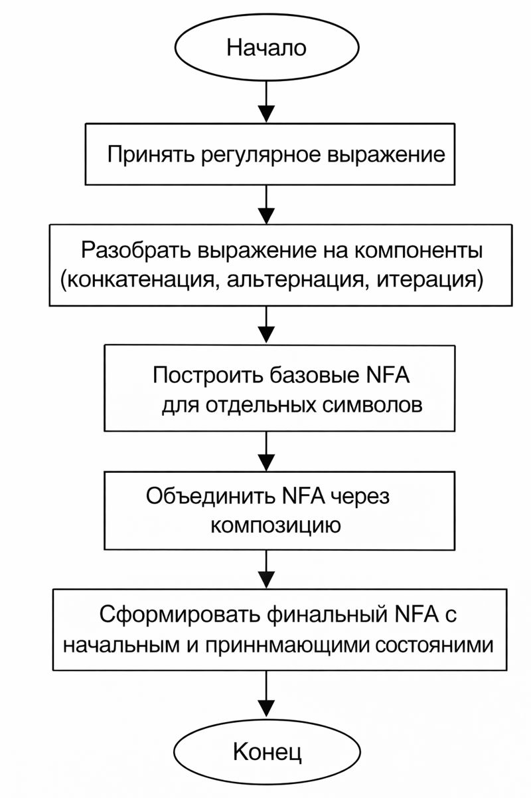
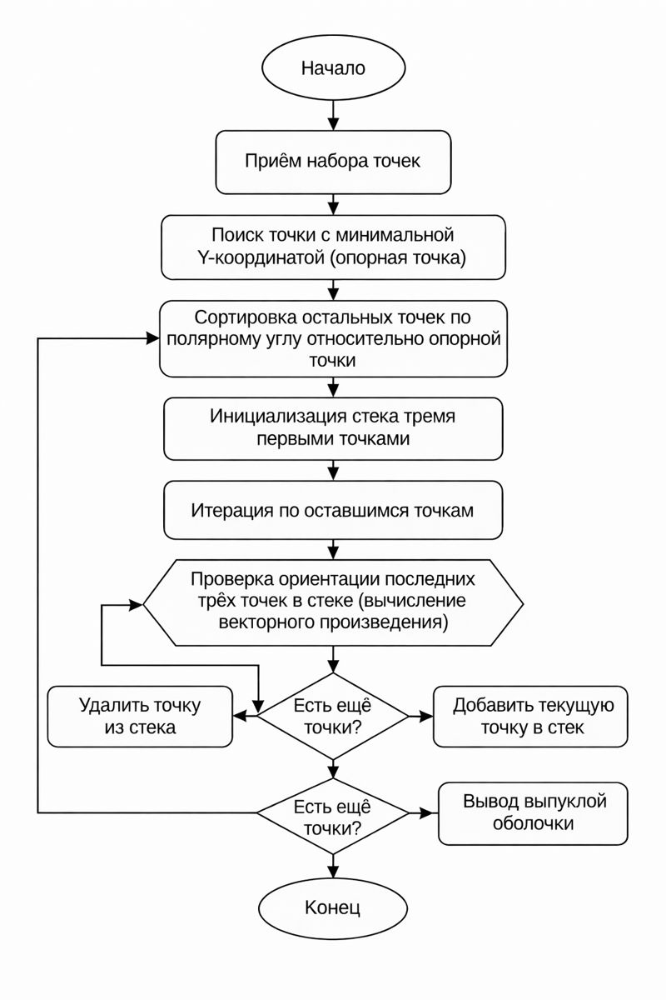
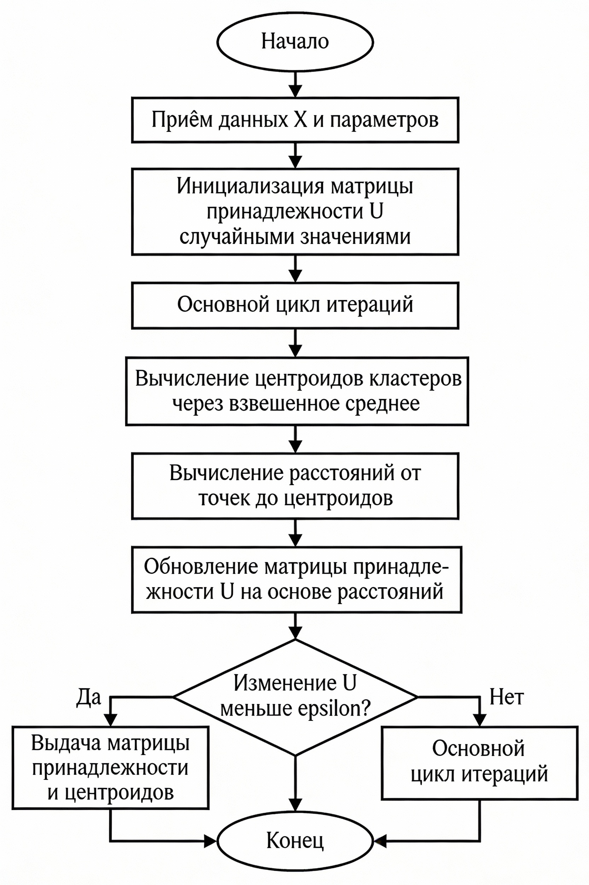

# ЛАБОРАТОРНАЯ РАБОТА 13-17
## Анализ четырёх алгоритмических областей

---

## 1. КОНЕЧНЫЕ АВТОМАТЫ И РЕГУЛЯРНЫЕ ВЫРАЖЕНИЯ

### 1.1 Краткое описание области определения алгоритма

Конечные автоматы (Finite Automata) — это математическая модель, которая описывает систему, имеющую конечное число состояний. Данный алгоритм применяется для распознавания и обработки текстов, соответствующих определённому регулярному выражению (паттерну).

Основные компоненты:
- **Состояния (States)** — конечное множество позиций, в которых может находиться автомат
- **Символы входа (Alphabet)** — множество символов, которые читает автомат
- **Переходы (Transitions)** — правила движения между состояниями при чтении символа
- **Начальное состояние** — стартовая позиция
- **Принимающие состояния (Accept States)** — состояния, при достижении которых входная строка считается распознанной

Существует два типа конечных автоматов:
- **DFA (Детерминированный Конечный Автомат)** — из каждого состояния есть ровно один переход для каждого входного символа
- **NFA (Недетерминированный Конечный Автомат)** — из состояния может быть несколько переходов для одного символа или переходы по пустой строке (ε-переходы)

Применение: лексический анализ компиляторов, поиск паттернов в текстах, валидация форматов данных (email, телефон и т.д.).

---

### 1.2 Блок-схема работы алгоритма



---

### 1.3 Пошаговый анализ работы алгоритма

Рассмотрим алгоритм **NFA на примере регулярного выражения** `a(b|c)*d`:

**Этап 1: Инициализация**
1. Создаём пустой NFA с начальным состоянием q₀ и начальным набором активных состояний
2. Инициализируем пустые переходы и принимающие состояния

**Этап 2: Построение структуры NFA (Thompson's Construction)**
1. Разбиваем регулярное выражение на компоненты:
   - Конкатенация: `a`, затем `(b|c)*`, затем `d`
   - Альтернация: `b|c` (либо `b`, либо `c`)
   - Итерация: `*` означает ноль или более повторений

2. Для каждого базового символа создаём простой NFA:
   - Для символа `x`: два состояния (начальное и конечное) с переходом по `x`
   - Для альтернации `x|y`: объединяем два NFA через ε-переходы
   - Для итерации `x*`: добавляем ε-переходы, позволяющие пропустить или повторить

**Этап 3: Распознавание входной строки**
1. Начинаем с начального состояния автомата
2. Для каждого символа входной строки:
   - Находим все состояния, достижимые из текущего набора состояний
   - Добавляем ε-замыкание (все состояния, достижимые по пустым переходам)
3. После обработки всех символов проверяем, находится ли принимающее состояние в текущем наборе активных состояний
4. Если да — строка распознана, если нет — отклонена

**Пример работы с `ab` на регулярном выражении `a*b*`:**
- Начало: активно состояние {q₀}
- После `a`: переходим в состояния, связанные с `a`, остаём в {q₀} (благодаря `a*`), добавляем переход к следующей части
- После `b`: достигаем состояний для `b`, включаем принимающее состояние
- Результат: строка распознана ✓

---

### 1.5 Примерная оценка временной сложности

**Временная сложность:** O(n·m) где:
- `n` — длина входной строки
- `m` — количество состояний в NFA

**Объяснение:**
1. Для каждого символа входной строки (n итераций)
2. Мы проверяем переходы из всех активных состояний (в худшем случае до m состояний)
3. Для каждого активного состояния выполняем поиск ε-замыкания (O(m) за счёт BFS/DFS)
4. Итого: O(n) символов × O(m) проверок состояний = O(n·m)

**Альтернатива DFA:** преобразование NFA в DFA имеет экспоненциальную сложность в худшем случае (O(2^m) состояний), но распознавание строки будет O(n).

---

## 2. ВНЕШНИЕ АЛГОРИТМЫ СОРТИРОВКИ И РАБОТА С ВНЕШНЕЙ ПАМЯТЬЮ

### 2.1 Краткое описание области определения алгоритма

**External Merge Sort** — алгоритм сортировки больших наборов данных, размер которых превышает доступный объём оперативной памяти. Используется в системах управления базами данных (СУБД), обработке больших файлов и потоков данных.

Ключевая идея: разделить данные на блоки, которые уходят на вторичную память (диск), отсортировать каждый блок в памяти, а затем эффективно слить отсортированные блоки.

**Основные параметры:**
- **M** — объём доступной оперативной памяти
- **B** — размер одного блока данных (страница диска)
- **N** — общий размер данных для сортировки

**Применение:** сортировка больших таблиц БД, обработка логов серверов, работа с потоками видео/аудио.

---

### 2.2 Блок-схема работы алгоритма


---

### 2.3 Пошаговый анализ работы алгоритма

Алгоритм **External Merge Sort** состоит из двух фаз:

**ФАЗА 1: Разбиение и сортировка на месте (Pass 0)**

1. Читаем из входного файла блоки размером M в оперативную память
2. Сортируем каждый блок любым алгоритмом в памяти (например, QuickSort или MergeSort)
3. Записываем отсортированный блок во временный файл (например, `temp_0.txt`, `temp_1.txt` и т.д.)
4. Повторяем для всех блоков входного файла

Пример:
- Входные данные: `[7, 3, 9, 1, 5, 2, 8, 4]` (размер M = 4)
- Блок 1: `[7, 3, 9, 1]` → после сортировки `[1, 3, 7, 9]` → `temp_0.txt`
- Блок 2: `[5, 2, 8, 4]` → после сортировки `[2, 4, 5, 8]` → `temp_1.txt`

**ФАЗА 2: Слияние отсортированных блоков (Merging Pass)**

1. Открываем k временных файлов (где k — число блоков)
2. Создаём минимальную кучу (Min-Heap) размером k
3. Читаем по одному элементу из каждого файла и добавляем в кучу
4. Извлекаем минимальный элемент из кучи и записываем в выходной файл
5. Читаем следующий элемент из файла, из которого мы только что извлекли элемент
6. Добавляем новый элемент в кучу (если файл не пуст)
7. Повторяем шаги 4-6 до тех пор, пока все элементы не будут перемещены в выходной файл

Пример слияния:
- `temp_0.txt`: `[1, 3, 7, 9]`
- `temp_1.txt`: `[2, 4, 5, 8]`
- Куча: `{1, 2}` (минимальные элементы из каждого файла)
- Выписываем 1, читаем 3, куча становится `{2, 3}`
- Выписываем 2, читаем 4, куча становится `{3, 4}`
- И так далее... Результат: `[1, 2, 3, 4, 5, 7, 8, 9]`

**Если блоков больше, чем можно одновременно держать в памяти:**
- Выполняем многопроходное слияние: сначала k₁ блоков, потом k₂ блоков и т.д.

---

### 2.5 Примерная оценка временной сложности

**Временная сложность: O(N log_k N)** где:
- N — количество элементов для сортировки
- k — количество блоков (k = ⌈N/M⌉)
- log_k N — количество проходов слияния

**Более точно: O((N/B) · log(N/M))** в операциях ввода-вывода, где:
- (N/B) — количество блоков, прочитанных с диска
- log(N/M) — количество итераций слияния (сколько раз нужно сливать блоки)

**Объяснение:**
1. **Фаза разбиения:** O(N·log M) — сортируем каждый блок размером M, всего ⌈N/M⌉ блоков
2. **Фаза слияния:** 
   - На каждом проходе читаем все N элементов и пишем их обратно
   - Количество проходов = ⌈log_k(N/M)⌉ где k = M/B
   - Каждый проход стоит O(N) операций ввода-вывода

3. **Почему именно такая сложность:**
   - Если данные умещаются в памяти (N ≤ M), то обычный MergeSort: O(N log N) операций
   - Если данные не умещаются, основную стоимость составляют операции диска (медленнее, чем операции в памяти)
   - Куча размером k для слияния позволяет эффективно находить минимум за O(log k)

---

## 3. ВЫЧИСЛИТЕЛЬНАЯ ГЕОМЕТРИЯ: ВЫПУКЛАЯ ОБОЛОЧКА

### 3.1 Краткое описание области определения алгоритма

**Graham Scan** — алгоритм поиска выпуклой оболочки (Convex Hull) для набора точек на плоскости. Выпуклая оболочка — это наименьший выпуклый многоугольник, который содержит все заданные точки.

**Основные понятия:**
- **Выпуклое множество** — множество точек, для которого весь отрезок между любыми двумя точками лежит внутри множества
- **Выпуклая оболочка** — наименьшее выпуклое множество, содержащее все исходные точки
- **Полярный угол** — угол между осью X и вектором из опорной точки в данную точку
- **Векторное произведение (cross product)** — используется для определения ориентации трёх точек (левый или правый поворот)

**Применение:** компьютерная графика (отсечение объектов), робототехника (планирование пути), вычислительная геометрия, обработка изображений.

---

### 3.2 Блок-схема работы алгоритма



---

### 3.3 Пошаговый анализ работы алгоритма

Алгоритм **Graham Scan** работает следующим образом:

**Шаг 1: Поиск опорной точки (Anchor Point)**
1. Проходим по всем точкам и находим точку с минимальной Y-координатой
2. Если есть несколько точек с одинаковой Y, выбираем с минимальной X-координатой
3. Эта точка гарантированно находится на выпуклой оболочке
4. Обозначим её как P₀

Пример: точки {(0,3), (1,1), (2,2), (4,4), (0,0), (1,2), (3,1), (3,3)}
→ P₀ = (0,0)

**Шаг 2: Сортировка по полярному углу**
1. Для остальных точек вычисляем полярный угол относительно P₀:
   - `θ = atan2(point.y - P₀.y, point.x - P₀.x)`
2. Сортируем точки в порядке возрастания полярного угла
3. Если два точки имеют одинаковый угол, сортируем по расстоянию от P₀

Пример (после сортировки):
P₀=(0,0), P₁=(1,1), P₂=(1,2), P₃=(2,2), P₄=(3,1), P₅=(3,3), P₆=(4,4)

**Шаг 3: Построение выпуклой оболочки (Graham Scan)**
1. Инициализируем стек с первыми двумя точками: [P₀, P₁]
2. Для каждой следующей точки Pᵢ:
   a) Пока в стеке есть хотя бы 2 точки И ориентация(вторая-с-конца, последняя, текущая) образует правый поворот:
      - Удаляем последнюю точку из стека
   b) Добавляем текущую точку Pᵢ в стек
3. После обработки всех точек стек содержит вершины выпуклой оболочки в порядке против часовой стрелки

**Определение ориентации через векторное произведение:**
Для трёх точек A, B, C:
- `cross = (B.x - A.x) · (C.y - A.y) - (B.y - A.y) · (C.x - A.x)`
- Если cross > 0: левый поворот (против часовой)
- Если cross = 0: коллинеарные точки
- Если cross < 0: правый поворот (по часовой)

**Пример пошагово:**
- Стек: [P₀(0,0), P₁(1,1)]
- Проверяем P₂(1,2): ориентация(P₀, P₁, P₂) = левый поворот → добавляем
  Стек: [P₀(0,0), P₁(1,1), P₂(1,2)]
- Проверяем P₃(2,2): ориентация(P₁, P₂, P₃) = левый поворот → добавляем
- И так далее...

**Результат:** Стек содержит вершины выпуклой оболочки (обычно 4-8 точек из исходного набора)

---

### 3.5 Примерная оценка временной сложности

**Временная сложность: O(n log n)** где n — количество точек

**Объяснение сложности:**
1. **Поиск опорной точки:** O(n)
   - Проход по всем точкам один раз

2. **Сортировка по полярному углу:** O(n log n)
   - Стандартная сортировка (QuickSort или MergeSort)
   - Для каждой пары точек вычисляем угол за O(1)

3. **Graham Scan (построение оболочки):** O(n)
   - Каждая точка добавляется в стек ровно один раз
   - Каждая точка удаляется из стека не более одного раза
   - Проверка ориентации (векторное произведение) — O(1)

**Итого:** O(n) + O(n log n) + O(n) = **O(n log n)**

**Почему именно эта сложность:**
- Главная операция — сортировка по углам (O(n log n))
- Остальные операции имеют линейную сложность (O(n))
- Стоимость операций в стеке амортизируется по времени выполнения

**Пространственная сложность:** O(n) для хранения точек и стека результата

---

## 4. НЕЧЕТКИЕ МНОЖЕСТВА И НЕЧЕТКАЯ КЛАСТЕРИЗАЦИЯ

### 4.1 Краткое описание области определения алгоритма

**Fuzzy C-Means (FCM)** — алгоритм кластеризации, обобщение классического K-Means, где вместо жёсткого разделения (каждая точка принадлежит ровно одному кластеру) используется мягкое разделение через степени принадлежности.

**Основные концепции:**
- **Нечёткое множество (Fuzzy Set)** — множество, где каждый элемент имеет степень принадлежности μ ∈ [0, 1], а не просто "принадлежит" или "не принадлежит"
- **Матрица принадлежности U** — матрица размером c × n, где U[i][j] — степень принадлежности j-й точки i-му кластеру
- **Параметр фаззификации m** — показатель нечёткости (m > 1, обычно m = 2):
  - m → 1: поведение приближается к жёсткой кластеризации (K-Means)
  - m → ∞: все степени принадлежности стремятся к 1/c (полная неопределённость)
- **Центроид кластера** — взвешенное среднее всех точек, веса — степени принадлежности в степени m

**Применение:** анализ изображений, медицинская диагностика, паттерн-распознавание, анализ социальных сетей, где объекты могут частично принадлежать нескольким категориям одновременно.

---

### 4.2 Блок-схема работы алгоритма



---

### 4.3 Пошаговый анализ работы алгоритма

Алгоритм **Fuzzy C-Means** работает итеративно:

**Инициализация:**
1. Выбираем количество кластеров c
2. Выбираем параметр фаззификации m (обычно 2)
3. Устанавливаем пороговое значение сходимости ε (например, 0.001)
4. Случайно инициализируем матрицу принадлежности U размером c × n:
   - U[i][j] ∈ [0, 1] — случайное значение
   - Нормализуем строки: ∑U[i][j] = 1 для каждой точки j

**Итерационный процесс (повторяется до сходимости):**

**Шаг 1: Обновление центроидов (Centroids Update)**
Для каждого кластера i вычисляем новый центроид V[i]:

```
V[i] = (∑ U[i][j]^m · X[j]) / (∑ U[i][j]^m)
       j=1..n                  j=1..n
```

Где:
- U[i][j]^m — степень принадлежности в степени m (сильнее влияют точки с высокой принадлежностью)
- X[j] — координаты j-й точки данных

Пример: если точка (2,3) имеет степень принадлежности 0.8 к кластеру 1, то её вклад в центроид: 0.8² × (2,3) = 0.64 × (2,3)

**Шаг 2: Обновление матрицы принадлежности**
Для каждой точки j и кластера i вычисляем новую степень принадлежности:

```
U[i][j] = 1 / (∑ (d[i][j] / d[k][j])^(2/(m-1)))
              k=1..c
```

Где:
- d[i][j] — евклидово расстояние между точкой j и центроидом кластера i
- d[k][j] — расстояния до всех других кластеров

Это можно переписать как:
```
U[i][j] = (1 / d[i][j])^(2/(m-1)) / (∑ (1 / d[k][j])^(2/(m-1)))
                                    k=1..c
```

**Интерпретация:**
- Точки близко к центроиду i имеют высокую U[i][j] (близко к 1)
- Точки далеко от центроида i имеют низкую U[i][j] (близко к 0)
- Параметр m/(m-1) = 2/(2-1) = 2 усиливает различие в расстояниях

**Шаг 3: Проверка сходимости**
Вычисляем норму разницы между старой и новой матрицей:
```
||U_new - U_old|| < ε
```

Если сходимость достигнута, алгоритм завершается.
Если нет, возвращаемся к Шагу 1.

**Пример работы (2 кластера, 4 точки, m=2):**

Начальные точки: {(0,0), (0,1), (5,5), (6,6)}

Итерация 0:
```
U = [0.5  0.5  0.5  0.5]  (случайная инициализация)
    [0.5  0.5  0.5  0.5]
```

Итерация 1:
- Центроид 1: V1 = (0.25·0 + 0.25·0 + 0.25·5 + 0.25·6) / 1 = (2.75, 2.75)
- Центроид 2: V2 = тоже (2.75, 2.75) (симметрично)
- Обновляем U на основе расстояний к V1 и V2...

Итерация N (после сходимости):
```
U = [0.95  0.92  0.05  0.01]  (точки 1,2 в кластер 1)
    [0.05  0.08  0.95  0.99]  (точки 3,4 в кластер 2)
```

V1 ≈ (0, 0.5) — центр первого кластера
V2 ≈ (5.5, 5.5) — центр второго кластера

---

### 4.5 Примерная оценка временной сложности

**Временная сложность: O(n·c·t·d)** где:
- n — количество точек данных
- c — количество кластеров
- t — количество итераций для сходимости
- d — размерность данных (количество признаков)

**Детальное объяснение:**

1. **Инициализация U:** O(n·c)
   - Создаём матрицу размером c × n

2. **Основной цикл (повторяется t раз):**

   a) **Обновление центроидов:** O(n·c·d)
      - Для каждого из c кластеров
      - Суммируем по n точкам, каждая операция — O(d) на вычисление взвешенного среднего
   
   b) **Обновление матрицы U:** O(n·c·d)
      - Для каждой из n точек
      - Вычисляем расстояние до c центроидов (O(c·d))
      - Обновляем степень принадлежности (O(c) нормировка)
   
   c) **Проверка сходимости:** O(n·c)
      - Вычисляем норму матрицы разницы

3. **Итого:** O(n·c·t·d)

**Практический анализ:**
- Если d = 2 (двумерные точки): O(n·c·t)
- Если t ≈ 20 итераций, c = 3 кластера, n = 1000 точек: ≈ 60 000 операций (быстро)
- Если n = 1 000 000 (Big Data): может потребоваться оптимизация или использование мини-батчей

**Сравнение с K-Means:**
- K-Means: O(n·c·t·d) — тот же порядок
- FCM: в 2-3 раза медленнее K-Means в практике из-за дополнительных вычислений степеней принадлежности

**Сложность по памяти:** O(n·c) для матрицы U

---

# ИТОГОВАЯ СВОДКА

| Алгоритм | Временная сложность | Пространственная сложность | Применение |
|----------|-------------------|--------------------------|-----------|
| NFA для регулярных выражений | O(n·m) | O(m) | Поиск паттернов, лексический анализ |
| External Merge Sort | O(N log(N/M)) операций ввода-вывода | O(M) | Сортировка Big Data на диске |
| Graham Scan (выпуклая оболочка) | O(n log n) | O(n) | Компьютерная графика, вычисл. геометрия |
| Fuzzy C-Means | O(n·c·t·d) | O(n·c) | Мягкая кластеризация, анализ данных |
